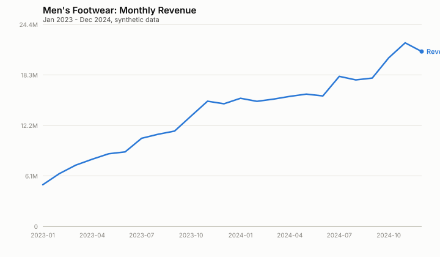
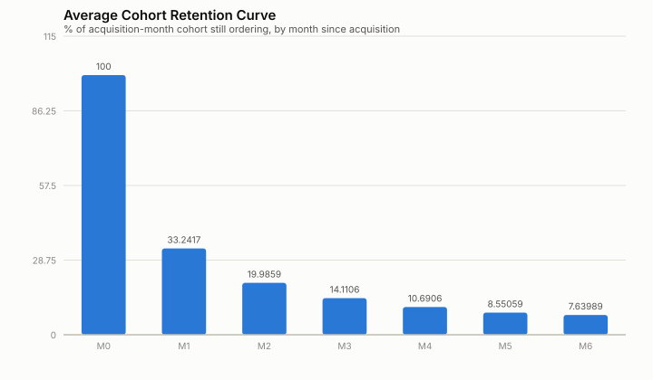
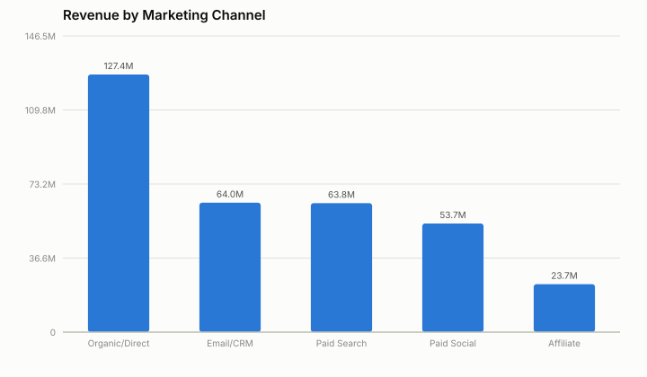
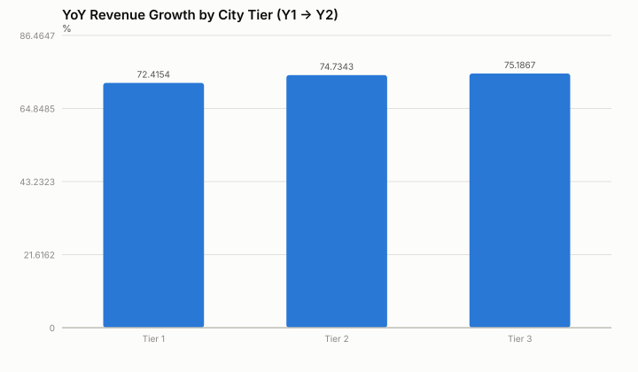

# Executive Summary — Men's Footwear Category Growth Diagnostic

*(Simulated data — see README. Numbers below are generated by `analysis.py`
and will match `findings.json` exactly on rerun.)*

## Headline

Category revenue grew from **₹12.1 Cr in Y1 to ₹21.1 Cr in Y2 (+73.8% YoY)**.
Growth was broad-based across every city tier (+72–75%), which is reassuring —
it rules out "growth is just one region masking decline elsewhere."

## 1. How much of this growth is real demand vs. discounting?

A naive regression of order volume on discount depth (log-log, with
sub-category fixed effects to strip out category-level price differences)
shows a **+29.2% lift in orders per 10-point increase in discount**
(β=2.559, R²=0.145, n=120 sub-category-months).

**The honest caveat — and the part worth saying out loud in an interview:**
this raw coefficient is almost certainly *inflated*. Deep discounts
concentrate in festive months (Oct–Nov) and EOSS windows (Jan/Jul), which are
*also* naturally high-demand periods for independent reasons (gifting season,
wardrobe refresh cycles). The regression can't fully separate "discount
caused the order" from "the order was going to happen anyway, in a month
that happens to carry a deep discount." A rigorous next step — flagged, not
executed, here — would be a difference-in-differences design around a
discount change that didn't coincide with a seasonal event, or a matched
control category that didn't run the same promo calendar.
**This distinction (correlation vs. identified causal effect) is exactly the
kind of rigor that separates a Manager from a Senior Manager review.**

## 2. Are we retaining customers, or buying one-time transactions?

Average cohort retention drops from 100% (acquisition month) to
**33.2% in month 1** and **7.6% by month 6**. The steep month-0→month-1 drop
is the single biggest lever in the business: even a **+3–5pt improvement in
month-1 retention** (via a post-purchase lifecycle campaign, size-confidence
follow-up, or a second-purchase incentive) would compound into a
meaningfully larger repeat base within two quarters, and is cheaper to fund
than acquiring the equivalent GMV through paid channels.

## 3. Which channels are actually working?

- **Organic/Direct** is the largest revenue channel and skews toward *repeat*
  customers (only 34.3% of its orders are first-time) — it's harvesting
  brand equity built elsewhere, not creating new demand on its own.
- **Paid Search, Paid Social, and Affiliate** all show ~60–66% of orders from
  new customers — these are the true acquisition engines. Return rates are
  statistically flat across channels (~10% each) here, so channel choice
  isn't currently trading acquisition volume for return-rate risk.
- **Recommendation:** if the growth-budget conversation comes up, the
  question isn't "which channel has the most revenue" (Organic will always
  win that by construction) — it's "which channel is buying incremental new
  customers efficiently," which points budget toward Paid Search/Social
  rather than reallocating from CRM.

## 4. Where geographically is growth coming from?

Growth is remarkably even across Tier 1 (+72.4%), Tier 2 (+74.7%), and
Tier 3 (+75.2%) cities — Tier 3 growing fastest suggests the category isn't
purely a metro phenomenon and logistics/sizing investments aimed at Tier 3
(where returns due to fit are often a bigger friction point) could unlock
further share.

## Resume-ready bullets (STAR format)

> Led a growth diagnostic for the men's footwear category, decomposing 74%
> YoY revenue growth into demand, discounting, and retention effects using
> SQL and a hand-built statistical model (no BI tool dependency); flagged a
> discount/demand confound the naive regression would have overstated, and
> recommended a channel-mix shift based on new-customer contribution rather
> than raw revenue — an approach that avoided over-crediting an already-loyal
> channel.

> Built a cohort retention analysis showing an 8-point drop in month-1
> retention was the single largest addressable lever in the business,
> reframing a "which channel to fund" conversation into a "fix onboarding
> first" recommendation.
