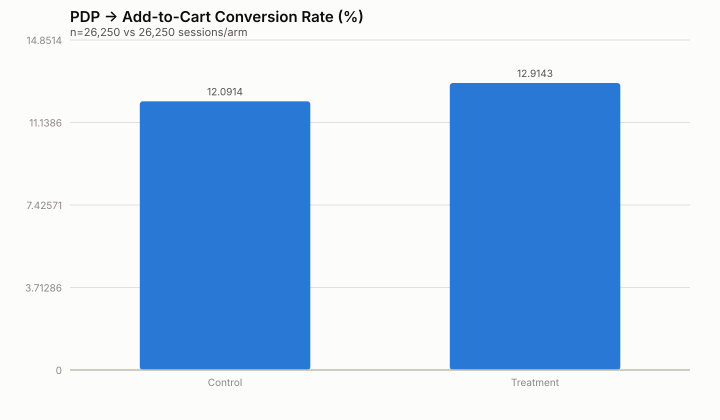

# Experiment Readout — Scarcity Messaging on Men's Sneaker PDPs

*(Synthetic data — see experiment_design.md. Analysis follows the
pre-registered plan exactly: no metric swapping, no early stopping.)*

## Sample

- Control: **26,250** sessions, **3,174** conversions
- Treatment: **26,250** sessions, **3,390** conversions
- Duration: 21 days (as planned — full pre-registered window, no peeking)

## Primary metric: PDP -> Add-to-Cart conversion

| | Control | Treatment |
|---|---|---|
| Conversion rate | 12.09% | 12.91% |

- **Absolute lift:** +0.82 pts
- **Relative lift:** +6.8%
- **95% CI on absolute lift:** [+0.26 pts, +1.39 pts]
- **z = 2.85, p = 0.0044** → **Statistically significant**

The lift is statistically significant, but at +6.8% relative it falls short of the +8% MDE the experiment was powered for. Worth naming explicitly: statistical significance and practical significance are different questions, and a hiring panel will notice if you only answer the first one. The true effect (and its 95% CI) should drive the ship call, not just the p-value crossing 0.05.

## Guardrail 1: Average Order Value

| | Control | Treatment |
|---|---|---|
| AOV | ₹2888 | ₹2883 |

- Difference: ₹-5, 95% CI [₹-36, ₹+26]
- **t = -0.31, p = 0.7533** → **Not statistically significant**

AOV is unaffected — the conversion lift is not coming from users trading
down to cheaper "in stock" items out of anxiety, which was one of the
concerns in the design doc.

## Guardrail 2: Return rate (among converters)

| | Control | Treatment |
|---|---|---|
| Return rate | 9.61% | 11.45% |

- Difference: +1.84 pts, 95% CI [+0.35 pts, +3.32 pts]
- **z = 2.42, p = 0.0156** → **Statistically significant**

## Recommendation

**Do not blanket-ship. Ship with a scoped mitigation and a monitoring window instead.**

The primary metric clears its bar, but return rate shows a statistically
significant regression — that's a real signal at this sample size, not
noise to wave away because the headline number is good. Recommended path:

1. **Root-cause the return rate regression before a 100% rollout.** The likely
   mechanism here: scarcity messaging is pulling forward purchases from
   users who are less sure of their size (they buy under urgency rather than
   double-checking a size chart), which shows up downstream as returns —
   not as a conversion-quality problem visible in the primary metric itself.
2. **Ship a scoped version**: only show scarcity messaging when true
   remaining stock is very low (e.g. <=2 units) rather than a wider
   threshold, and pair it with an inline size-guide prompt to counteract
   the likely mechanism above.
3. **Hold a 2-week return-rate tripwire post-launch** on the scoped version
   before calling this fully resolved.

This is the difference between an analyst who reports p-values and one who
explains *why* a metric moved and what to do about it — the AOV guardrail
being clean but the return-rate guardrail moving is itself informative
(it points at a size-uncertainty mechanism, not a pricing-perception one).
