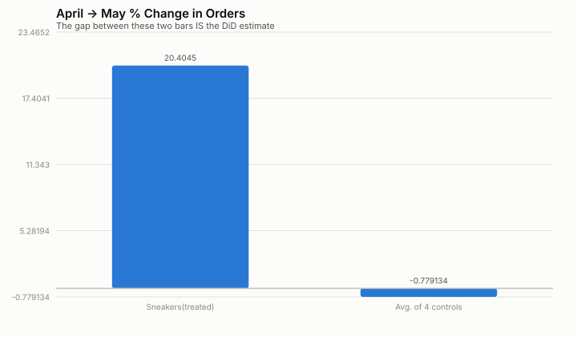

# Causal Readout — Does a Discount *Cause* More Orders? (DiD)

*(Synthetic data — see README. This project directly follows up on Project
01's caveat: that a naive discount/demand regression is confounded by
seasonality. Here, the discount shock is deliberately placed in a
seasonally flat month, isolated to one category, so the comparison is
clean.)*

## The setup

In **May 2024** — a month touched by no festive or EOSS seasonal effect —
Sneakers ran a one-off inventory-clearance discount (+15pts over its usual
level). No other category's discount or seasonal environment changed that
month. That's the natural experiment: if orders jump for Sneakers alone,
relative to how the other categories moved over the same window, that gap
is a defensible estimate of the discount's *causal* effect.

## Step 1 — Check the identifying assumption before trusting the result

DiD is only valid if Sneakers and the control categories were moving
*together* before the event (parallel trends). Correlation of month-to-month
growth rates, Jan-Apr, Sneakers vs. each control:

- vs. Casual Shoes: r = 0.84
- vs. Formal Shoes: r = 0.96
- vs. Sandals & Floaters: r = 0.83
- vs. Sports Shoes: r = 0.67

These are reasonably high and positive -- consistent with (not proof of) parallel trends. Worth saying plainly: parallel trends is an assumption, not something a pre-period correlation can fully confirm; it can only fail to contradict it.

## Step 2 — The DiD estimate

| | Apr -> May 2024 |
|---|---|
| Sneakers (treated) | +20.4% |
| Avg. of 4 controls | -0.8% |
| **DiD estimate (the gap)** | **+21.3%** |

Rescaled to the same "+10pt discount" units Project 01 used for its naive
estimate, for a direct comparison:

| | % order lift per +10pt discount |
|---|---|
| Project 01's naive/confounded regression | **+29.2%** |
| **This causal (DiD) estimate** | **+13.8%** |

**This is the headline finding:** the naive estimate overstated the true
discount effect by roughly 15 points, because it
was picking up festive/EOSS seasonal demand riding along with festive/EOSS
discounts. The causal estimate isolates the discount's own effect from that
seasonal confound — this is the number that should actually inform a
pricing decision.

## Step 3 — Is this estimate distinguishable from noise? (Permutation test)

With only 5 categories (4 possible controls), a classical standard error on
the DiD estimate would rest on asymptotics that don't hold at this sample
size — a well-known problem with few-cluster DiD. Instead: pretend each
control category was "treated" in the same month, compute the same DiD
estimator for it, and see where the *actual* Sneakers effect falls among
those placebo effects (Fisher-style randomization inference).

- Placebo 'Casual Shoes': -2.2%
- Placebo 'Formal Shoes': -2.0%
- Placebo 'Sandals & Floaters': +4.0%
- Placebo 'Sports Shoes': +0.3%
- **Actual (Sneakers): +21.3%**

**Permutation p-value ≈ 0.20** (0 of 4 placebo effects were at least as extreme as the actual one).

**Honest caveat, not buried:** with only 4 placebo draws, the smallest
possible p-value this test can produce is 1/5 = 0.20 — it mechanically
cannot reach conventional significance thresholds (p<0.05) no matter how
large the true effect is. The right conclusion isn't "this proves the
effect at p<0.05" — it's "the actual effect is the largest-magnitude one
among all 5 categories, which is suggestive but not proof at this sample
size." A stronger version of this test would need more comparable
categories or additional pre-treatment months as placebo *time* windows
(testing whether a fake 'event' in, say, March also produces a large
effect) — a natural next iteration, not done here.

## Why this project matters more than the number it produces

The result itself is modest — a smaller, more defensible discount-elasticity
estimate, with an honestly limited significance test. That's the point.
Anyone can regress two columns and report a coefficient. Recognizing *when*
that coefficient is confounded (Project 01), designing an isolated
comparison to fix it (this project), and then being upfront about the
remaining statistical limits of that fix (the permutation p-value) is the
actual skill a Senior Manager Analytics or a data-informed PM review is
testing for.
