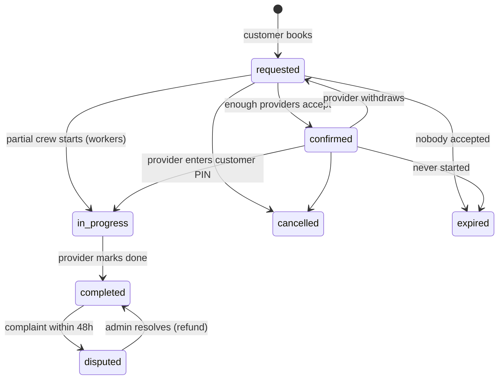

# KhetSaathi (खेत साथी)

Book a **tractor**, **farm workers**, a **mechanic** or an **experienced farmer**
for your field, the way you book a cab. It's built for people in villages and
Tier-3 towns who own land but don't have time to work it themselves. Hindi and
English, phone-first, pay in cash after the work.

- **Product plan** (problem, users, pricing, getting users, roadmap): [`docs/PRODUCT.md`](docs/PRODUCT.md)
- **Edge cases** (every rule, each one tested): [`docs/EDGE_CASES.md`](docs/EDGE_CASES.md)
- **Deploying** (static demo → server → pilot → Android app): [`docs/DEPLOY.md`](docs/DEPLOY.md)

## Try it

**No install:** open `dist/khetsaathi-demo.html` in a browser. Use the
**Demo → Try as** box to switch between the customer, the tractor owner, a
worker, the mechanic and admin. **⏩ Jump to job time** moves the demo clock so
you can start a job booked for tomorrow.

**With the server** (shared data, like production):
```bash
cd playground/khetsaathi
node server.js          # http://localhost:8080  (Node 18+, no npm install needed)
npm test                # 32 tests
```

A 2-minute walkthrough:
1. Log in as **Vinod (customer)** with any mobile number. In demo mode the OTP
   is shown on screen.
2. Tap **Tractor** → Rotavator → afternoon → 3 acres → **Confirm booking**. Note the PIN.
3. Switch to **Ramesh · tractor** → **Earn** → open the new job → **Accept job**.
4. **⏩ Jump to job time** → enter the PIN → **Start work** → **Mark work complete**.
5. Switch back to Vinod → rate it. Switch to **Admin** to see GMV and fill rate move.

## How it's built

```
public/core.js    all business rules + API router (runs in Node AND the browser)
public/app.js     the web app (plain JS; screens, Hindi/English)
public/style.css  design tokens, light + dark
server.js         Node http server: static files + /api, saves to data/db.json
test/             node:test suites, with a fake clock for time-based rules
scripts/          build-demo.js (single-file build), e2e.js (Playwright journey)
```

The same `core.js` powers the server and the offline demo, so what the tests
prove is what users get. There are no dependencies to install, update or get
hacked through.

### Booking lifecycle



### API (JSON, `Authorization: Bearer <token>`)

| Method | Path | Who |
|---|---|---|
| POST | `/api/auth/otp`, `/api/auth/verify`, `/api/auth/logout` | anyone |
| GET | `/api/catalog`, `/api/health`, `/api/villages/nearest?lat=&lng=` | anyone |
| GET/PATCH | `/api/me` | user |
| POST | `/api/quote`, `/api/bookings` · GET `/api/bookings`, `/api/bookings/:id` | customer |
| POST | `/api/bookings/:id/cancel`, `/reschedule`, `/rate`, `/dispute` | customer |
| POST | `/api/provider`, `/api/provider/online` · GET `/api/provider/jobs` | provider |
| POST | `/api/bookings/:id/accept`, `/withdraw`, `/start`, `/complete` | provider |
| GET | `/api/admin/overview` · POST `/api/admin/providers/:id`, `/api/admin/bookings/:id/resolve` | admin |

All data in the demo (people, phone numbers, bookings) is made up.
