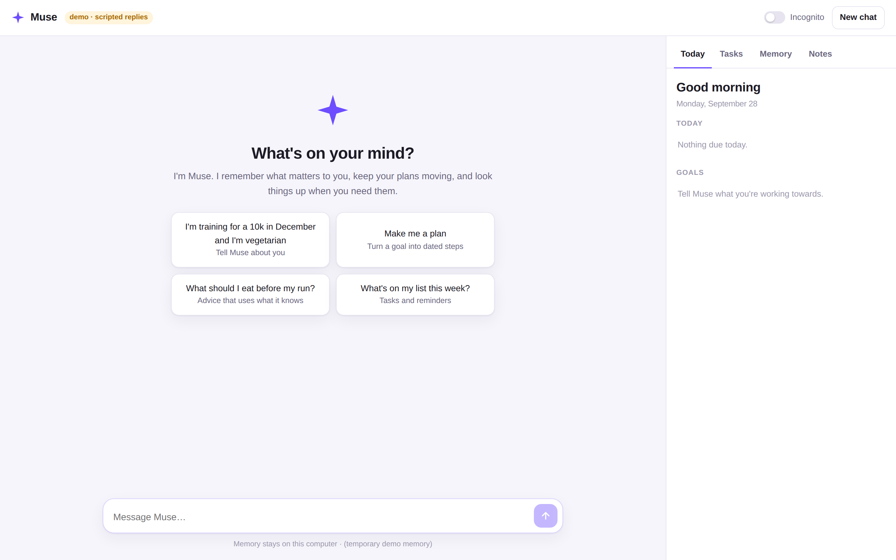
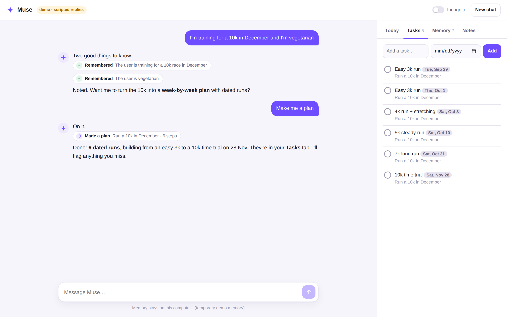
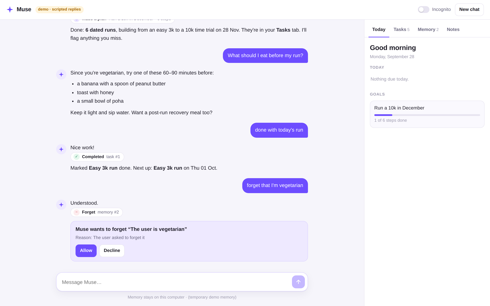
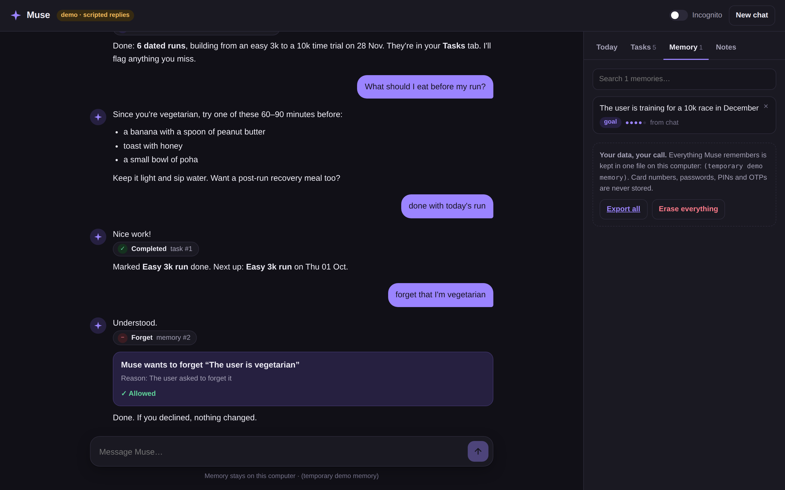
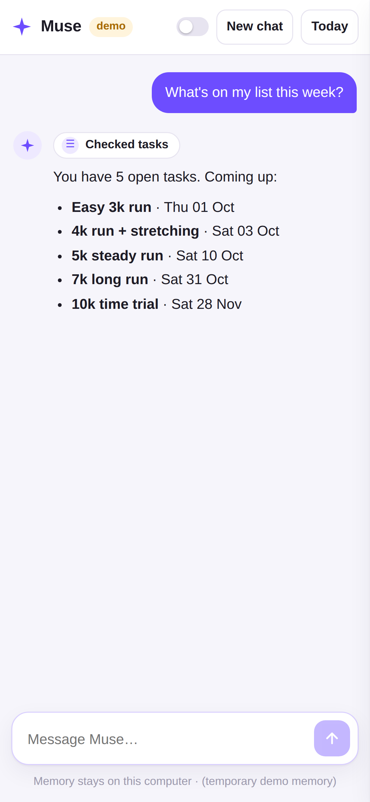
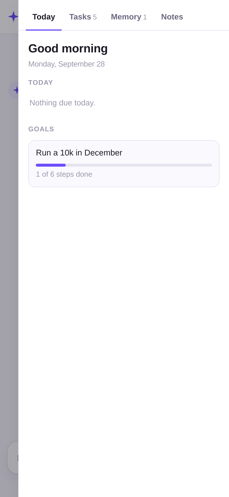
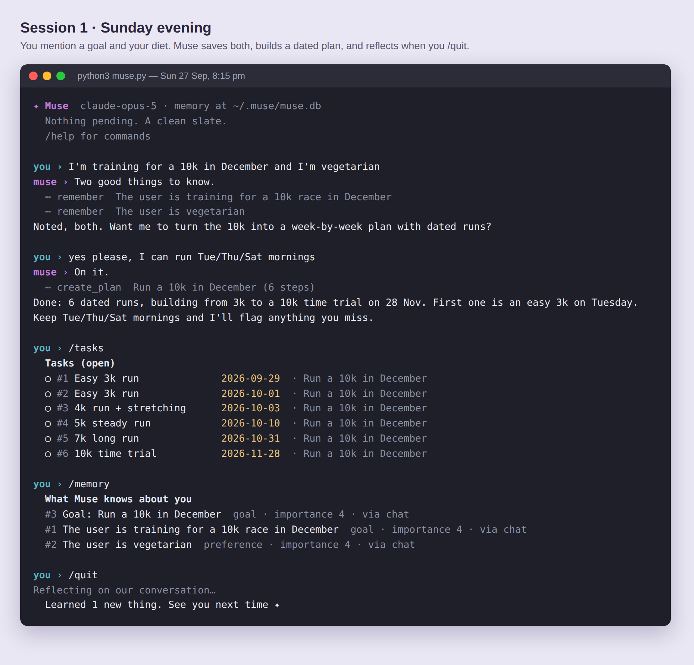
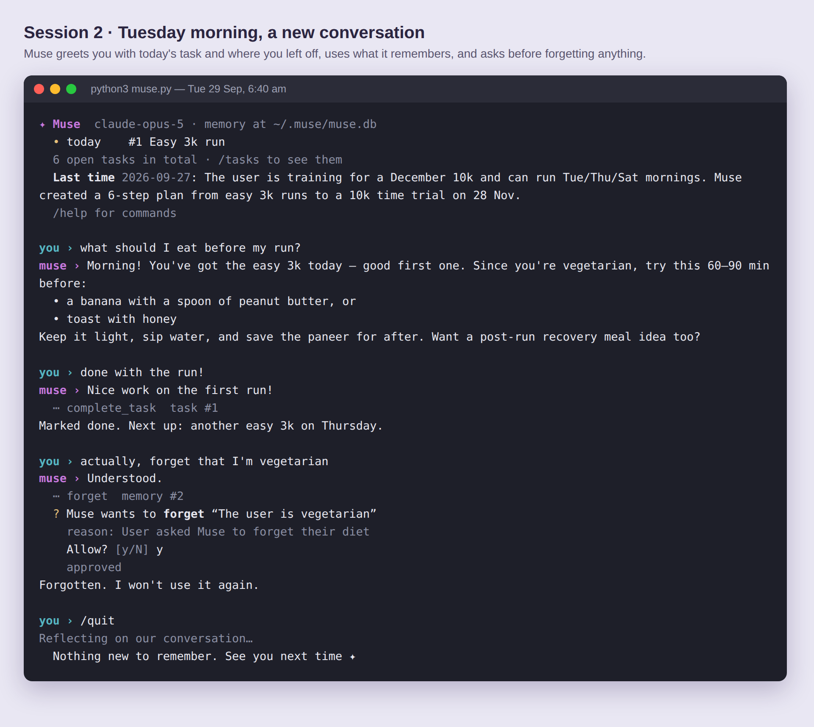

# Muse: a personal AI agent that gets to know you

Muse is a terminal assistant built on Claude. It **remembers you across conversations**,
**acts** for you (tasks, reminders, dated goal plans, notes, live web research), and
**brings things up** when they matter. All your data stays in one SQLite file on your own
machine, and you can see, edit and delete every part of it.

```bash
cd playground/muse
pip install -r requirements.txt
export ANTHROPIC_API_KEY=sk-ant-...        # console.anthropic.com
python3 web.py                             # the app: opens http://127.0.0.1:8765 in your browser
python3 web.py --demo                      # try the app with no API key (scripted replies, throwaway memory)
python3 muse.py                            # or chat in the terminal (add --incognito to save nothing)
```

## The app









<p>


</p>

- **Chat** streams replies word by word. Each action Muse takes shows as a small chip:
  remembered, made a plan, searched the web, and so on.
- **Approval cards** appear inline whenever Muse wants to do something that needs your yes.
- **Today** shows what's overdue or due today, your goals with progress bars, and a summary
  of your last conversation.
- **Tasks** lets you add tasks and tick them off. **Memory** lets you search and delete
  anything Muse knows. **Notes** holds what it has saved for you.
- **Incognito** switch: nothing from the conversation is saved. **New chat**: Muse reflects,
  saves what matters, and starts fresh.
- Light and dark themes follow your system. On a phone the side panel becomes a drawer.
- **Private by design.** The app runs on your own computer at `127.0.0.1`, so nothing else
  on your network can reach it. It loads no fonts, scripts or trackers from the internet, and
  it rejects requests from other websites.

These screenshots come from `web.py --demo`. The replies are scripted; everything else
(memory, tasks, approvals, reflection) is the real app.

<details><summary>Terminal version</summary>





</details>

## How it works

```
             ┌───────────── every message ─────────────┐
 you ──▶ 1. RETRIEVE  core profile + BM25-relevant memories + due tasks
                      + relevant notes + last chat summary ─▶ <muse_context>
         2. THINK/ACT  Claude streams a reply; tool calls run locally
                      (memory, tasks, plans, notes, maths) or on Anthropic's
                      servers (web_search, web_fetch); loop until done
             └──────────────────────────────────────────┘
 /quit ─▶ 3. REFLECT  one structured-output call: new durable facts,
                      outdated memories to retire, an episode summary
```

| File | What it does |
|---|---|
| `web.py` | The app's local web server: state API, streaming chat, approvals (stdlib only) |
| `static/index.html` | The app itself: one self-contained page, no external resources |
| `demo.py` | Scripted stand-in for Claude, used by `web.py --demo` |
| `muse.py` | The terminal version: chat, slash commands, approval prompts, startup briefing |
| `brain.py` | System prompt, per-turn context, the agent loop, end-of-session reflection |
| `memory.py` | SQLite store (facts, tasks, notes, episodes) and hand-written BM25 retrieval |
| `tools.py` | Tool schemas, input validation, safe calculator, approval and incognito rules |
| `config.py` | Model, effort, limits, data location (all can be overridden with env vars) |
| `tests/test_muse.py` | 24 offline tests: memory, tools, the agent loop against a scripted fake Claude, and the web server over real HTTP |

## Features that make it more than a chatbot

- **Two-way memory.** Muse saves facts while you talk (`remember`). When you leave, it
  *reflects* on the conversation to pick up anything it missed and to retire facts that are
  now wrong ("moved from Delhi to Bengaluru"). Similar facts are merged, not duplicated.
- **Memory selected for each message.** It doesn't paste everything into every prompt.
  Each turn gets your top facts by importance, plus the ones BM25 ranks as relevant to that
  message (weighted by importance and how often each fact proved useful).
- **Goals become plans.** `create_plan` turns "run a 10k by December" into dated tasks
  linked to that goal, and overdue steps come up in later conversations.
- **Live research with sources.** It uses the server-side `web_search` / `web_fetch`
  tools and cites links. It can save findings as notes for later.
- **Continuity.** Each session ends with an episode summary, so the next conversation
  starts from where the last one left off.
- **You stay in control:**
  - `/memory` shows everything Muse knows and where each fact came from.
  - `/forget`, `/export`, and `/wipe` let you remove or take out your data.
  - `--incognito` or `/incognito` means nothing gets saved and no reflection runs.
  - When Muse wants to forget something on its own, it needs your yes.
  - Its own deletes are soft deletes, so they can be undone.
  - Web page text is treated as data, never as instructions.
  - Muse is told never to put your name, contact details, address, card or bank details
    or other identifiers into web searches or fetched URLs. It searches the general topic
    instead.
  - Card numbers, passwords, PINs, CVVs and OTPs are blocked in code: Muse refuses to save
    them to memory, notes or tasks, even if asked.
- **Robust loop.**
  - Tool inputs stream as they are generated and are checked against their schema before
    they run.
  - A tool call that was cut off never runs.
  - Web-search `pause_turn` is resumed automatically.
  - If a refused request is still refused after the server-side fallback, the turn is rolled
    back cleanly.
  - The system prompt stays exactly the same all session, so prompt caching keeps long
    chats cheap.

## Settings

| Env var | Default | |
|---|---|---|
| `MUSE_MODEL` | `claude-opus-5` | |
| `MUSE_EFFORT` | `medium` | `low`…`max`; raise it for deep research or planning |
| `MUSE_HOME` | `~/.muse` | where `muse.db` lives (never inside this repo) |

Requests turn on the server-side refusal fallback (`fallbacks: "default"`, beta
`server-side-fallback-2026-07-01`). If the safety classifiers decline a request, the API
retries it on the model Anthropic recommends for that case instead of failing.

## Run the tests (no API key needed)

```bash
python3 -m unittest discover -s playground/muse/tests -v
```

## Ideas to extend it

- Scheduled check-ins: run a morning brief each day by cron, or with a Claude Managed
  Agents scheduled deployment.
- Calendar and email connectors (read-only first, with an approval gate on anything sent).
- Embedding-based retrieval next to BM25, once there are hundreds of facts.
- Voice in and out in the app (the browser speech APIs work offline on most systems).
